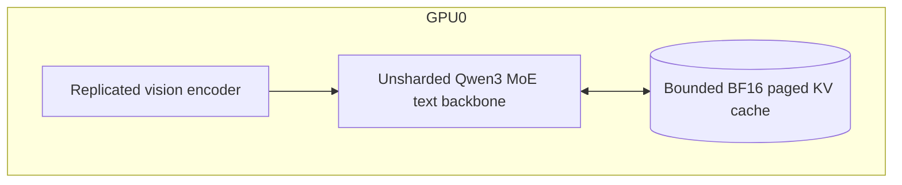
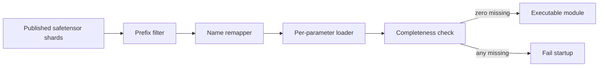

# PR 0 design: single-GPU correctness baseline

Status: implementation present; system acceptance blocked by unavailable
real-checkpoint CUDA evidence in this workspace.

## 1. Purpose

PR 0 answers one question only: does the selected Qwen3-VL computation graph,
checkpoint mapping, multimodal positioning, and greedy decode match the official
Transformers 4.57.x reference with tensor parallelism disabled?

It does not prove continuous batching, TP, 72B-class fit, or performance.

## 2. Deployment boundary



`configs/qwenvl.yaml` is the PR-0 topology and the CLI default. The config
reserves 128 pages at 128 tokens per page. For 48 layers, 4 KV heads,
head_dim 128, K+V, and BF16:

```text
48 * 128 pages * 128 tokens * 4 heads * 128 dims * 2(K,V) * 2 bytes
= 1.5 GiB
```

Using the engine default of 2,048 pages would consume about 24 GiB just for KV
storage, before roughly 62 GB of BF16 checkpoint tensors, vision activations,
workspace, and framework overhead. Full 256K residency is therefore not a PR-0
claim.

## 3. Data contracts

### Prompt processing

Input:

- one text prompt;
- zero or more decoded image tensors in CHW float `[0,1]`;
- no video.

Output:

- `text_inputs`: one token tensor;
- `position_ids`: `[3, tokens]` temporal/height/width positions;
- for image prompts, `pixel_values` and the complete `[num_images,3]`
  `image_grid_thw` matrix.

Images are converted to uint8 HWC before the official processor to avoid
double-rescaling.

### Vision node

The pinned Transformers 4.57.x `Qwen3VLMoeVisionModel` returns:

```text
(merged_hidden_states, deepstack_feature_list)
```

The adapter passes the merged language-width tensor and exactly three DeepStack
feature tensors to the LLM. Upgrading Transformers across major version 5 must
re-audit this internal return contract.

### LLM node

1. Replace each image placeholder embedding with one merged vision feature.
2. Compute Qwen3 interleaved MRoPE from three-axis position IDs.
3. Inject DeepStack feature `i` after text decoder layer `i` for `i=0..2`.
4. Advance KV sequence length by token count and position state by the MRoPE
   span.
5. Select the last token of each packed request, project logits, and sample.

## 4. Checkpoint admission



| Published path | MStar path/action |
| --- | --- |
| `model.language_model.*` | `model.*`, except outer `lm_head` |
| `lm_head.weight` | `lm_head.weight` |
| `model.visual.*` | Vision prefix stripped |
| separate `q_proj/k_proj/v_proj` | fused `qkv_proj` parameter loader |
| fused expert `[E,H,2I]`, `[E,I,H]` | transpose into MStar linear execution order |
| rotary buffers | explicitly skipped |

Synthetic tests must use `H != 2I` so an accidental expert-layout transpose
cannot pass because dimensions happen to be equal.

## 5. Reference parity protocol

Use one deterministic text-only prompt and at least three image cases:

1. one image, one prompt;
2. two images in one prompt;
3. non-square image grid whose merged H and W differ.

For each case:

- use the same published checkpoint and processor revision;
- use BF16 on the same GPU;
- compare MRoPE position IDs and cos/sin tensors first;
- compare merged vision and each DeepStack tensor;
- compare prefill last-token logits;
- compare the first N greedy tokens and final decoded text;
- record tolerances and the first divergent layer/token when a gate fails.

## 6. Acceptance gates

| Gate | Evidence | Pass condition |
| --- | --- | --- |
| P0-G1 config | Real published `config.json` | Supported architecture admitted; unsupported variants fail |
| P0-G2 loading | Real safetensor stream | Zero missing parameters, no shape mismatch, no uninitialized tensor |
| P0-G3 positions | Official `get_rope_index` oracle | Exact position IDs; cos/sin within dtype tolerance |
| P0-G4 text math | Official tiny and real reference | Hidden/logit tolerance documented and passing |
| P0-G5 vision math | Official tiny and real reference | Merged + three DeepStack outputs match |
| P0-G6 server | `mstar serve qwenvl` on one qualifying GPU | Fixed image prompt streams coherent text and stops at EOS/limit |
| P0-G7 resource bound | Peak allocated/reserved memory | No OOM under the PR-0 page budget, with headroom recorded |

PR 0 is merge-ready only when P0-G1 through P0-G7 pass. CPU tests alone are
code-level readiness.

## 7. Current evidence and gaps

Proven locally:

- tiny official Transformers text and image hidden-state parity;
- official two-image position-ID parity;
- strict synthetic checkpoint completeness and fused-layout handling;
- graph declaration, prompt conversion, cache position side-channel, packed
  last-token indexing, and decode-only EOS/max-token stop behavior;
- single-GPU config resolution.

Not proven:

- loading the actual 30B checkpoint;
- any real CUDA/FlashInfer execution;
- real image-to-text decoded output;
- single-GPU peak memory/headroom;
- 72B-class behavior.

## 8. Rollback rule

If a real-checkpoint gate fails, fix the owning PR-0 contract. Do not compensate
with TP-specific padding, relaxed completeness, ignored weights, or looser
output smoke tests.
